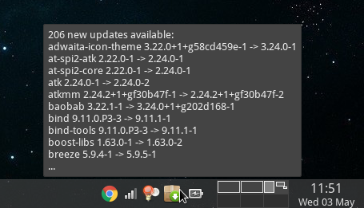

# Arch Update Checker

A small script that uses `checkupdates` on Arch Linux to check if there are any
new packages available. Then displays a small icon in the notification panel.

## Usage
Install `xfce4-genmon-plugin` and point `Command` to `genmon_updates.sh`.
Change the icon path in `genmon_updates.sh` to an image of your choice.
